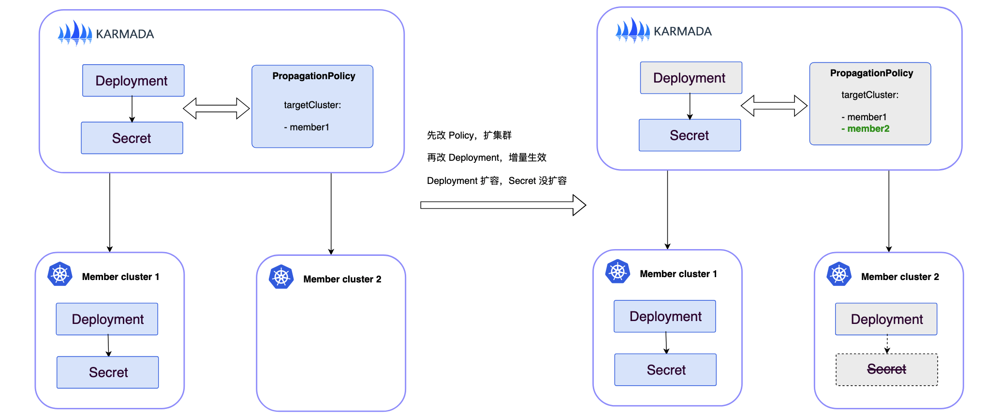

# 如何降低变更庞大 PropagationPolicy 时的风险

## Summary

在真实使用场景中，用户可能使用一个全局的 ClusterPropagationPolicy 作为资源模版的默认分发策略，那么修改这个 Policy
时会影响到太多命中的资源模板，导致用户不敢轻易变更该 Policy，用户希望有一个方案在执行这个操作时能尽可能规避风险。

在此背景下，本 Proposal 综合考虑了四种思路的方案，并最终选择在 ClusterPropagationPolicy 中新增字段以支持配置增量生效策略的方案：当在 ClusterPropagationPolicy
中开启增量生效策略后，变更该 Policy 对于命中的资源模版不会立即全量生效，而是：

* 已经分发成功的资源模板，修改后才会生效
* 在此之后新增的资源模版，立即生效

我们将这种生效策略简称为：增量生效策略 (PropagationPolicy同理)

## Motivation

为了方便大家更深刻地理解动机，首先带大家走进真实业务场景，本场景中有两个角色：

* 普通用户：完全不懂也不想学习 Karmada 的使用，只负责在某个 Namespace 下部署自己的应用涉及的资源
* 集群管理员：熟练 Karmada 的使用，负责维护 ClusterPropagationPolicy 等 Karmada CRD 资源

集群管理员不知道未来会有哪些用户、哪些 Namespace、哪些资源，因此他创建了一个全局的默认的 ClusterPropagationPolicy 去匹配所有的资源模板

随着用户逐渐接入，当前集群联邦中已部署了很多资源

此时，集群管理员产生这样的诉求：未来他需要变更 ClusterPropagationPolicy，例如新增一个分发集群，但他又害怕 ClusterPropagationPolicy
更新后导致大量的工作负载重启， 甚至会出现重启失败影响到用户业务，因此操作风险很大，他希望尽可能规避作为集群管理员的操作风险

### Method One

**为集群管理员变更 ClusterPropagationPolicy 提供 `dry-run` 能力**

例如：`karmadactl apply -f policy.yaml --dry-run`，执行后不会真的分发资源，只是会告诉用户此次变更会牵扯哪些资源、
各工作负载在成员集群将怎么分布等详细情况

优点：相比目前用户更新 PropagationPolicy 后完全不知道将会发生什么，集群管理员会对 Karmada 的行为有更清晰的认识，
他可以审视具体行为是否符合预期，一定程度上降低了风险

缺点：
* 实现难度较大
* 全局 ClusterPropagationPolicy 可能牵扯大量资源，即便有 `dry-run`，审视难度还是很大
* 即便用户知道了某个 deployment 将扩容到新增集群，是符合预期的结果，但他不敢保证新的 pod 能成功拉起，或者说没有解决他不想因为自己
  的操作影响到用户业务的根本诉求

总评：改动很大，收益不足

### Method Two

**为 ClusterPropagationPolicy 提供批量生效的策略**

集群管理员害怕自己变更 ClusterPropagationPolicy 造成大量工作负载雪崩式失败，如果能向他提供一种操作方案，让命中的资源挨个生效，例如前一个
deployment 已成功生效且结果符合预期，再使下一个命中的 deployment 生效，就能大大消减操作的顾虑

优点：是一种相对保险的变更方式

缺点：
* 实现难度较大
* 无法对各个用户部署的应用的生效顺序做先后排序，每个用户都觉得自己的应用更重要，应该后生效
* 履行新的 ClusterPropagationPolicy 需要很长时间
* 万一某个用户的 deployment 失败了，集群管理员可能还是无法应对 (或者我们还需提供回滚能力)

总评：实现成本较大

### Method Three

**ClusterPropagationPolicy 拆分**

变更时不要去修改全局 ClusterPropagationPolicy，而是以应用维度拆分出新的 PropagationPolicy 去替代/抢占全局 ClusterPropagationPolicy

优点：如果上述普通用户也熟练使用 Karmada，并愿意编写及维护为自己的应用定制化的 PropagationPolicy，则使用新的细粒度的
PropagationPolicy 去抢占原全局 ClusterPropagationPolicy，不失为一种好的实践

缺点：但在本案例中，普通用户不维护 PropagationPolicy，而集群管理员不感知普通用户的具体资源，目前不可行

总评：该方案在另一个需求中也在同步探索，如果用户能接受定制自己的 Policy，也可以用于解决本文集群管理员的根本诉求

### Method Four

**在 ClusterPropagationPolicy 中新增字段以支持配置增量生效策略**

当前 ClusterPropagationPolicy 变更后，会立即全量生效，影响所有命中的资源模版

如果为 ClusterPropagationPolicy 新增一种增量生效策略，变更该 Policy 对于命中的资源模版不会立即全量生效，而是：

* 已经分发成功的资源模板，修改后才会生效
* 在此之后新增的资源模版，立即生效

那么集群管理员修改 ClusterPropagationPolicy 不会产生任何风险，
因为修改资源模版是普通用户的行为，用户改自己的应用如果出现失败，用户可以自己应对，风险可控。

优点：

* 实现难度较低、满足集群管理员根本诉求
* 只是在原有 ClusterPropagationPolicy 上新增可选字段，只要不开启这个字段，对 Karmada 的行为来说就没有变化； 
  这一点也给升级时的兼容性减轻负担

缺点：详见下文 [Risks and Mitigations](#Risks-and-Mitigations)

总评：总体可行，对于集群管理员的诉求，是最契合的方案

## Proposal

基于上述 [Method Four](#method-four) 在 PropagationPolicy/ClusterPropagationPolicy 中新增 label `effect-strategy`：

* 值为 `all`: 全量生效策略，默认值，修改本 Policy 对命中的资源模版立即全量生效
* 值为 `incremental`：增量生效策略，修改本 Policy 对命中的资源模版增量生效

## Risks and Mitigations

### Risk 1

> 风险本质上没有凭空消失，只是从集群管理员转移到各个普通用户上，对普通用户可能不是很友好。
>
> 例如普通用户只是想在某 deployment 中加个 label，由于修改了 deployment 导致更新后的 Policy 生效，该 deployment 可能扩容到新的集群
>
> 但该 deployment 使用了某个 secret， 而该 secret 没有修改 (没有修改新 Policy 就不会生效)，因此新的集群没有该 secret
>
> 那么新集群的相应负载可能直接失败，一定程度上影响 了用户的使用体验 (用户只想给 deployment 加个 label, 不想理解后面一串牵扯的逻辑)



#### method 1.1

启用增量生效策略时，建议开启依赖跟随分发能力：
* 在 controller 中启用 `--feature-gates=PropagateDeps=true`，默认即开启
* 在相应 PropagationPolicy 中配置 `spec.propagateDeps=true`

这样，当 deployment 依赖了 secret，当 deployment 分发时也会带上相应的依赖的资源一起分发

局限性：只有 deployment 等资源模版中显示声明的依赖的资源可以自动跟随分发，具体应用程序在代码里隐式依赖的资源做不到跟随分发，
这一点是否可以容忍？

#### method 1.2

为什么用户不能将自己的应用一起全部更新一下？上述例子中根本问题在于，用户只想改 deployment，别的没打算改，而你不改的话，即便重新 apply，
资源模版 unchanged，也不会重新 `Reconcile`。那既然 `kubectl apply` 做不到这一点，我们是否可以考虑在 karmadactl 中 添加一个
`karmadactl reconcile` 的能力，不变更资源模版，只是触发筛选到的资源强制 `Reconcile`，例如：

```console
karmadactl reconcile secrets -l app=nginx
karmadactl reconcile all -l user=ucs
```

如此一来，只要某个应用涉及的资源都有共同的 label，就可以一键刷新应用涉及的所有资源模板；只要这个用户下所有资源都有共同的 label，
就可以一键刷新该用户下所有的资源模板

### Risk 2

> 和问题1类似，假设开启增量生效的新 Policy 会将命中的资源缩减集群，而 deployment 使用了某个 secret
>
> 如果用户只更新了该 secret，新 policy 对 secret 生效，计划被缩减的集群上的 secret 会被删掉
>
> 但是由于 deployment 没更新，新 Policy 不会 对 deployment 生效，计划被缩减的集群上的 deployment 还在，但它可能因为找不到所需的 secret 导致运行异常


#### method 2.1

依赖跟随分发可以解决 [Risk 1](#risk-1), 但不能解决此 Risk，因为 secret 属于被依赖的资源，资源模版里不能显示声明被谁依赖，依赖它的资源做不到跟随分发，
其本质原因还是 [Mitigations 1](#mitigations-1) 里所描述的局限性，这一点是否可以容忍？

个人认为可以容忍，这个问题还是要回到场景中，如果是个别用户或者个别应用需要缩集群，那其实集群管理员不会去改全局 Policy 去缩集群 (此时应使用用户定制的 Policy 去抢占原全局 Policy)，
改全局 Policy 一定是所有用户所有应用都想摘除某个集群，Policy 中期望的状态就是整个集群被干掉，只是这个期望的状态被延迟生效了，
那么这个过程中该集群难免出现脏状态；但既然这个集群是期望被干掉的，那该集群中负载的健康状态自然相对不是那么被关注的。

#### method 2.2

同上述 [method 1.2](#method-12)

### Risk 3

> 已经分发成功的资源模板在修改后才会生效，然而 Karmada 自己也会修改资源模版，例如添加 label、更新 status 字段
>
> 然而期望的结果是：用户修改后才应该生效、Karmada自己修改后不应该生效，那么如何区分资源模版是被用户修改还是 Karmada 自己修改

#### method 3.1

白名单方式，虽然我们不知道用户会修改啥，但是 Karmada 自己会修改哪些字段我们是知道的，所以对 Karmada 自己会修改的字段列举一个白名单，
是 Karmada 自己修改的就不让新 Policy 生效

#### method 3.2

### Risk 4

> 集群管理员可能会在全量策略、增量策略两种方式中来回切换，例如集群管理员希望默认是增量生效，但某一次修改希望直接全量生效，而这一次改完后又变回增量生效，
本方案的操作方式对集群管理员是否友好？

#### method 4.1

本 proposal 期望的是 Policy 默认全量生效，即不配新增的这个 label时，与以前 Karmada 的行为保持不变

那么 [Risk 4](#risk-4) 中集群管理员具体操作就是：编写全局的 Policy 时添加 label `effect-strategy=incremental`，
如果某次修改希望直接全量生效，就在修改的基础上把 label 也改成 `effect-strategy=all`，改完后又想变回增量生效，
就在把 label 改回来

#### method 4.2

参考 [method 1.2](#method-12)，被全局 ClusterPropagationPolicy (假设名为 policy-xx ) 命中的资源模板一定有 label `clusterpropagationpolicy.karmada.io/name=policy-xx`

因此，集群管理员直接将该 Policy 配置成增量生效，如果某次需要全量生效，直接执行：

```console
karmadactl reconcile all -l clusterpropagationpolicy.karmada.io/name=policy-xx
```

### Risk 5

> 当前资源模版的分发结果，会出现与当前 Policy 声明的分发策略不一致的情况，因为该资源模版可能命中的是上个版本甚至上上个版本的 Policy，
一定程度上不符合 k8s 声明式 API 的理念。

### Risk 6

> 当定位问题时也容易引起误导，如何区分是新的 Policy 写错了没命中导致没生效还是因为增量生效策略暂时没生效。

## Design Details

### Detector for Policy

修改 Detector 组件的逻辑

1）当 Detector 监听到 PropagationPolicy/ClusterPropagationPolicy 的新增或修改事件时，检查相应 Policy 
是否有 `effect-strategy` 标签，从而判断实施 `全量生效` 还是 `增量生效` 策略：

* 对于本 Policy 已命中的资源模版：
  * 全量生效：原逻辑不变，通过 LabelSelector 先找命中的 Binding，再找相应的资源模版，最后触发资源模版的 `Reconcile`
  * 增量生效：不做任何处理 (资源模版被主动更新时，自然会进入 `Reconcile` 逻辑)
* 对于尚未被 Policy 命中的 (处于 waitingList) 中的资源模版：
  * 全量生效：原逻辑不变，判断是否被本 Policy 命中，是则触发其 `Reconcile`
  * 增量生效：同全量生效
* Policy 开启了抢占
  * 全量生效：立即执行抢占逻辑
  * 增量生效：

pp更新时会判断已命中的资源是否不再被命中，如果是，会清除资源上的label，那么，当 pp 不再立即生效时，什么时机由谁去执行这个清除label的操作


2）当 Detector 监听到 PropagationPolicy/ClusterPropagationPolicy 的删除事件，

pp删除事件如何响应


### API Modify

none

### Test Plan

